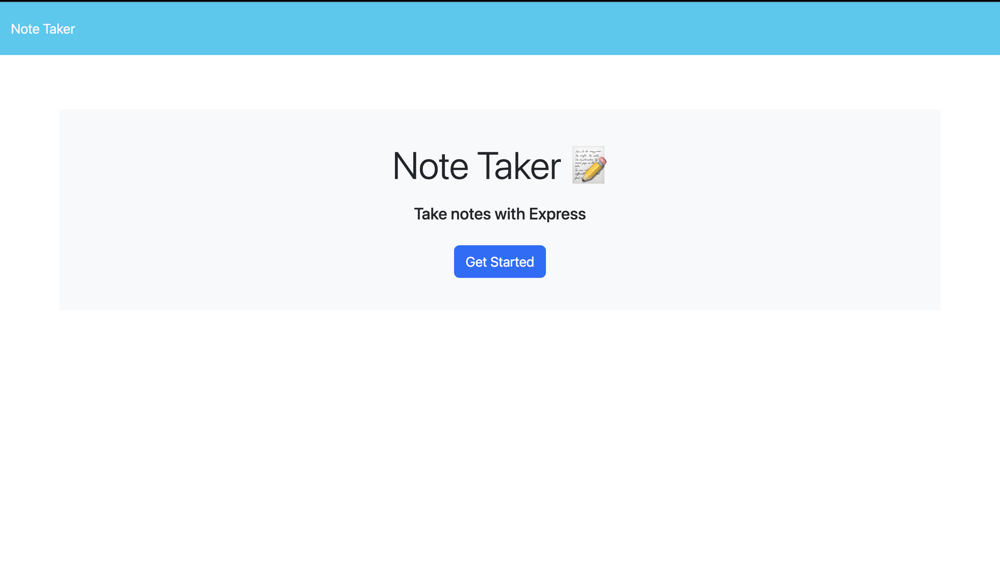

# Note Taker
The Note Taker app streamlines the note-taking process, offering users a clear interface with a link to access existing notes and fields to create new ones. Users can easily save, integrate, and manage notes, prioritizing functionality for effective task organization and thought management.

## Mock-Up

The following images show the web application's appearance and functionality:

[click here to open](https://adamem02.github.io/Elephant)

